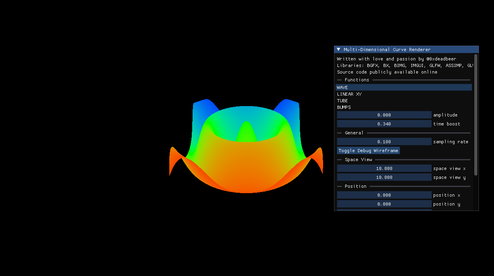
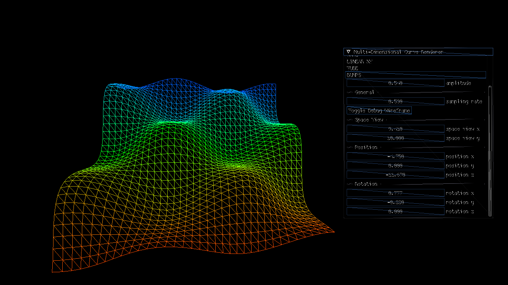
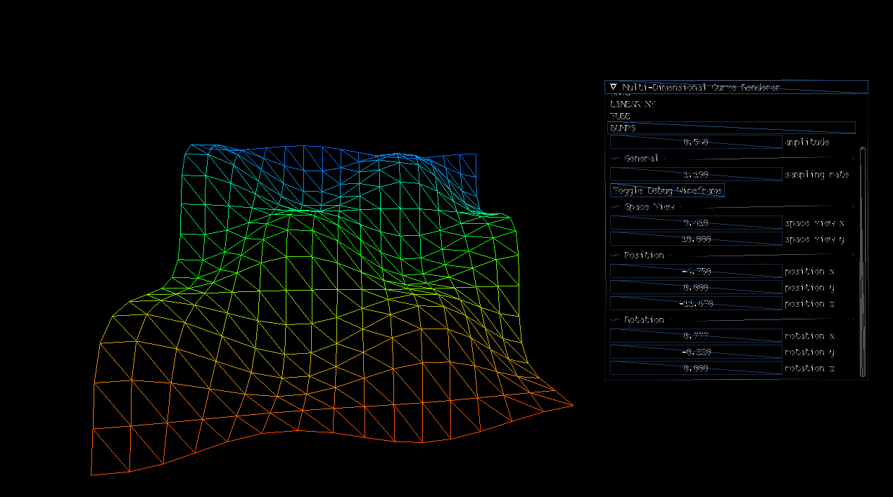

<p align="center" float="left">

	

</p>

# Function Renderer 

Three dimensional function renderer capable of displaying computational functions. 

Definition example:

```
float computational_function(float time, float x, float y) {
    return (pow(x,3)*y-pow(y,3)*y)/360;
}
```


The underlying API renderer is BGFX. Source code is in C++. Intermediate GPU is ran with the help of dear-imgui and a custom port of it to BGFX - which I took from the bigg framework (BGFX + IMGUI + GLFW + GLM). 

For the time being, this remains tested only on a modern linux kernel. Patches and pull requests that highten the project's value or make it more cross-platform are more than welcome. For any technical questions regarding the tool's source code, please contact me via email. 

# Build and Run 

I will soon upload a video on my YouTube channel on how to build it. It is quite tedious but if you are willing to do it, you can do it yourself for the time being. 

# SUBMODULES

	bgfx.cmake 
	glfw.cmake 
	imgui.cmake 
	assimp.cmake 
	glm.cmake
	
