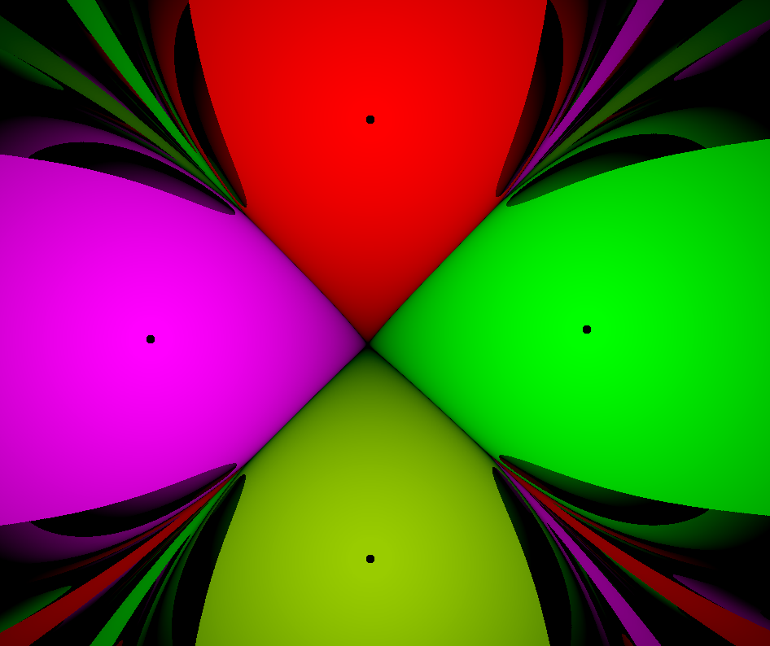
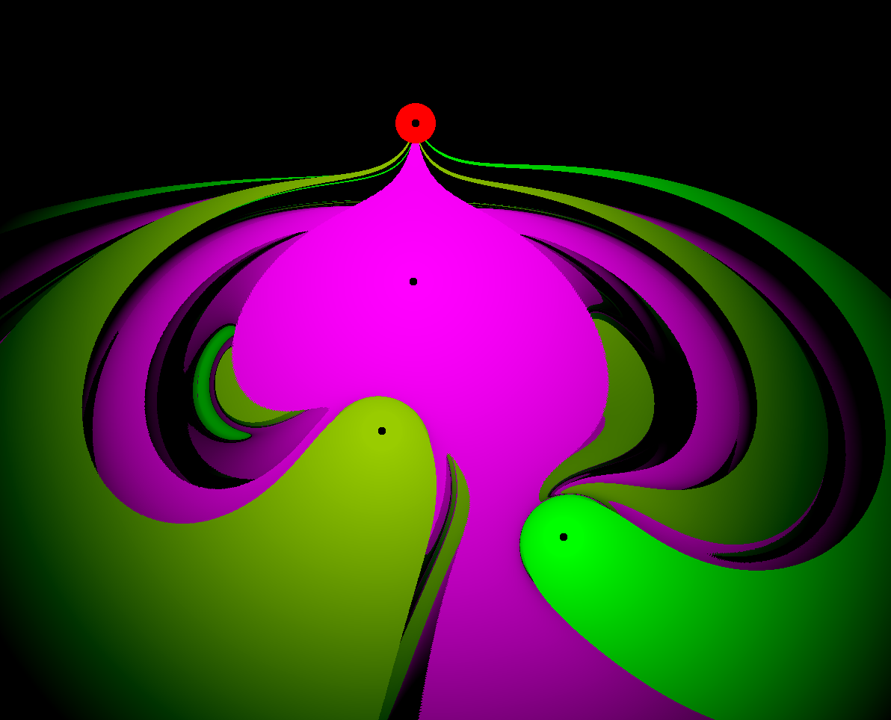
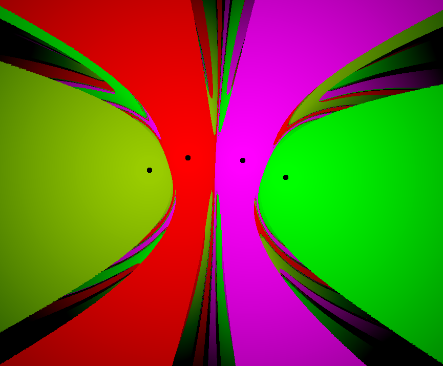
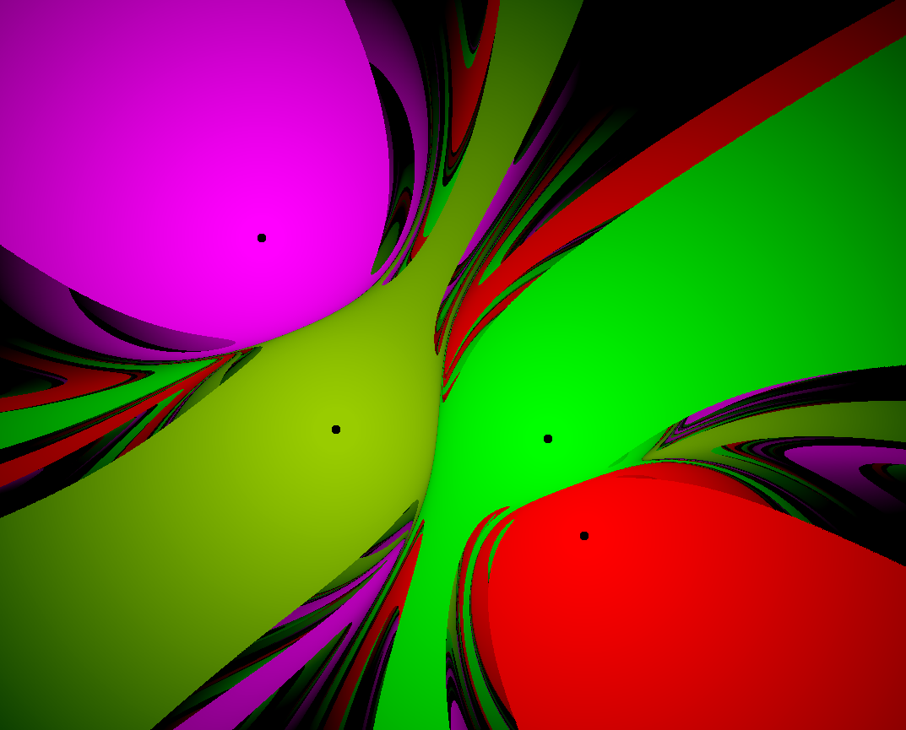
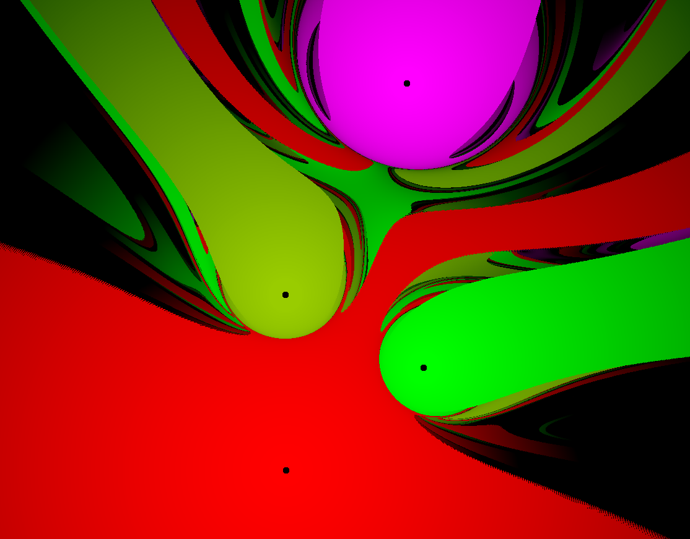
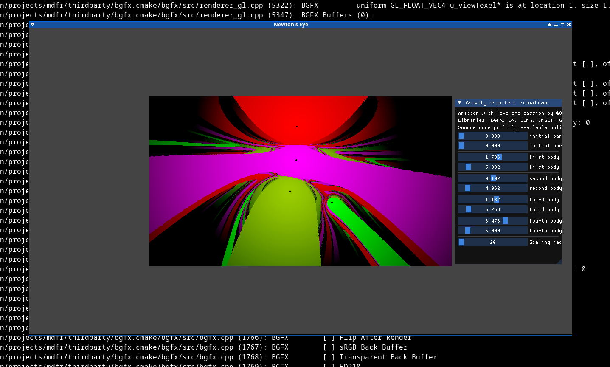

# Newton's Eye 

**Note**: I uploaded a [full showcase video](https://www.youtube.com/watch?v=zF82NdwvoQ4) on my YouTube channel 
**Note**: this project is highly inspired by [2swap's video on gravity basins](https://www.youtube.com/watch?v=LavXSS5Xtbg). I wanted to recreate it myself because I thought it was very beautiful and educative. The code is not perfect, because I was in a rush. PRs and suggestions are more than welcome. 

	

<i>Overview of the project</i>

 
The underlying API renderer is BGFX. Source code is in C++. Intermediate GPU is ran with the help of dear-imgui and a custom port of it to BGFX - which I took from the bigg framework (BGFX + IMGUI + GLFW + GLM). 

For the time being, this remains tested only on a modern linux kernel.

# Build and Run 

I will soon upload a video on my YouTube channel on how to build it. It is quite tedious but if you are willing to do it, you can do it yourself for the time being. 

# SUBMODULES

	bgfx.cmake 
	glfw.cmake 
	imgui.cmake 
	assimp.cmake 
	glm.cmake
	
