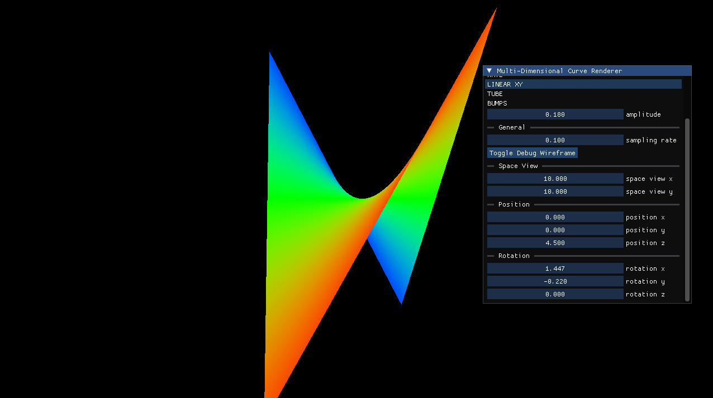
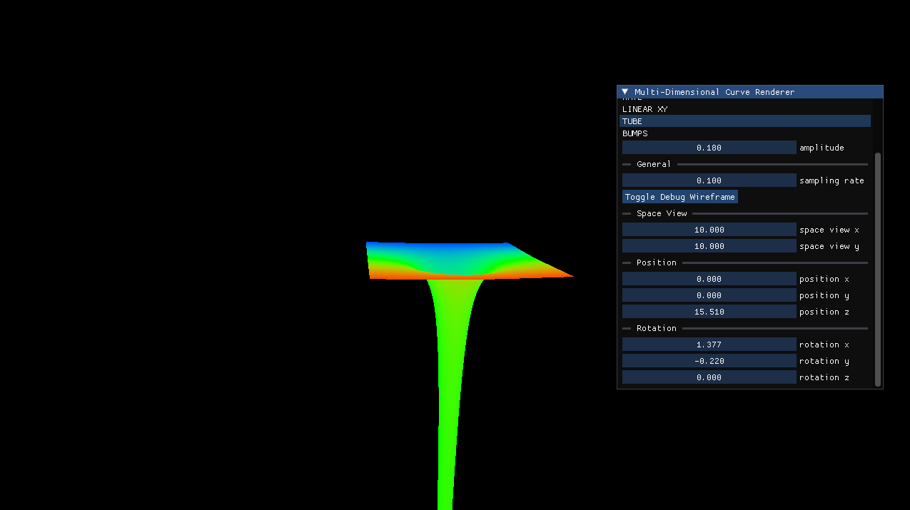
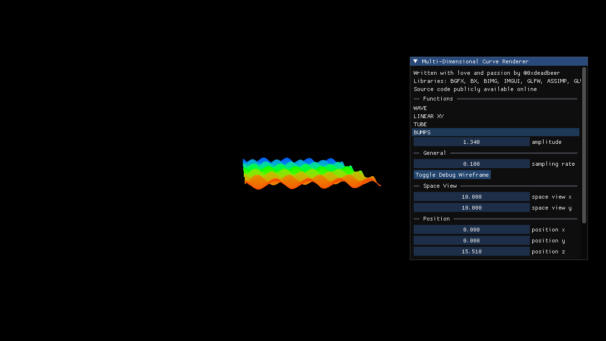

# Multi-Dimensional Curve Renderer 

Three dimensional (or even four if you plot color along three dimensions) curve renderer capable of displaying functions like f(x,y) = (x^3 * y - y^3 * x)/360. 

The underlying API renderer is BGFX. Source code is in C++. Intermediate GPU is ran with the help of dear-imgui and a custom port of it to BGFX - which I took from the bigg framework (BGFX + IMGUI + GLFW + GLM). 

For the time being, this remains tested only on a modern linux kernel. Patches and pull requests that highten the project's value or make it more cross-platform are more than welcome. For any technical questions regarding the tool's source code, please contact me via email. 

## Preview 

# Build and Run 

I will soon upload a video on my YouTube channel on how to build it. It is quite tedious but if you are willing to do it, you can do it yourself - I warned you. 

# SUBMODULES

	bgfx.cmake 
	glfw.cmake 
	imgui.cmake 
	assimp.cmake 
	glm.cmake
	